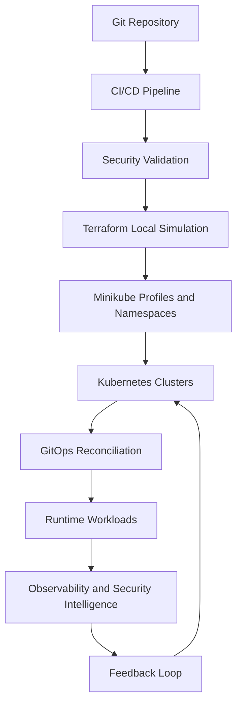

# Platform Architecture

This repository implements the structure described in the enterprise secure infrastructure design document.

## Scope

- Multi-cluster Kubernetes platform (simulated locally)
- Terraform-based local infrastructure simulation
- DevSecOps validation and policy gates
- Runtime security detection and alerting
- Observability across metrics, logs, and traces

## Local Execution Context

- Runtime: Docker
- Kubernetes: Minikube profiles or namespace isolation
- GitOps controllers: ArgoCD and Flux inside the cluster
- Infrastructure layer: local Terraform model with simulated network, cluster, and control-plane outputs

The local substrate does not alter architecture decisions. It executes the same control-loop and enforcement patterns expected in production.

## High-Level Flow

## Repository Conventions

- `terraform/` contains local simulation modules for network, cluster, security, and observability.
- `kubernetes/base/` contains reusable manifests.
- `kubernetes/overlays/` contains environment-specific settings.
- `gitops/argocd/` and `gitops/flux/` contain GitOps bootstrap layers.
- `policy/` and `security/` contain enforcement rules that are kept alongside the platform code.
- `observability/` contains alert and telemetry definitions.

## Implementation Approach

The scaffold is designed to be completed incrementally. Start with networking, identity, and cluster bootstrap, then add policy, observability, and runtime security controllers.
